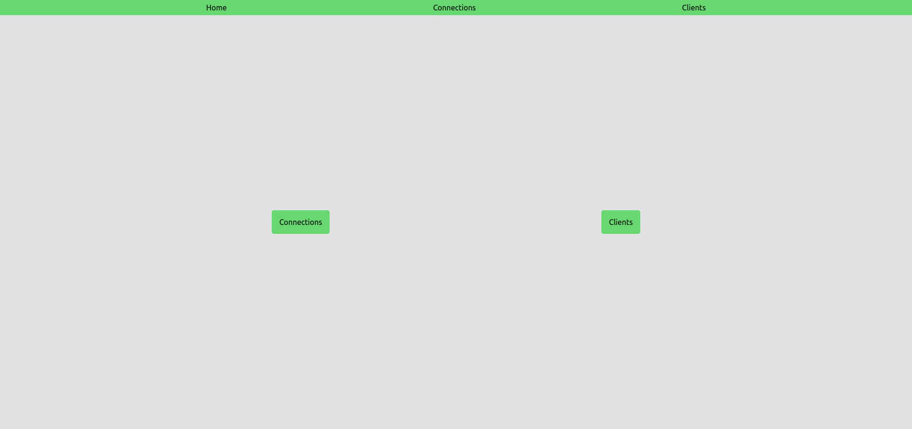
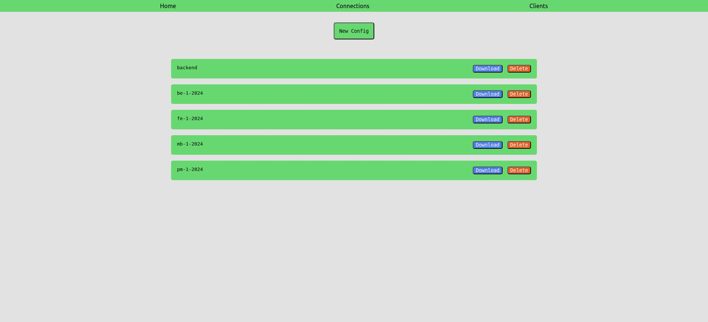
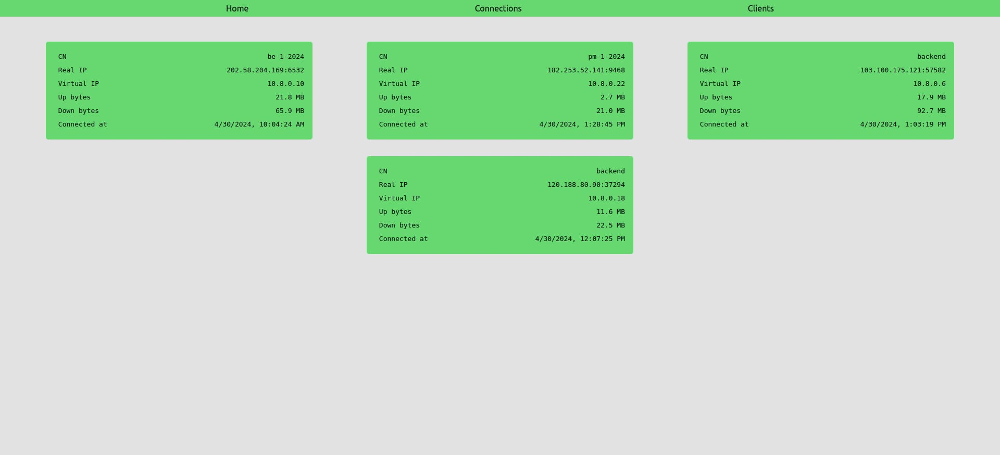

# OpenVPN Dashboard
A simple dashboard for OpenVPN server where you can current connections. You also can manage clients (configs file).

## Requirements
- Node.js
- Installed OpenVPN server. (For tutorial, https://www.digitalocean.com/community/tutorials/how-to-set-up-and-configure-an-openvpn-server-on-ubuntu-20-04)
- Installed CA server. (For tutorial, https://www.digitalocean.com/community/tutorials/how-to-set-up-and-configure-a-certificate-authority-ca-on-ubuntu-20-04)

## Installation
```bash
npm install
```
Rename `.env.example` to `.env` and fill it with your OpenVPN server and CA server information.
```bash
node index.js
```

## Usage
Access dashboard at http://localhost:3000

## Screenshots


